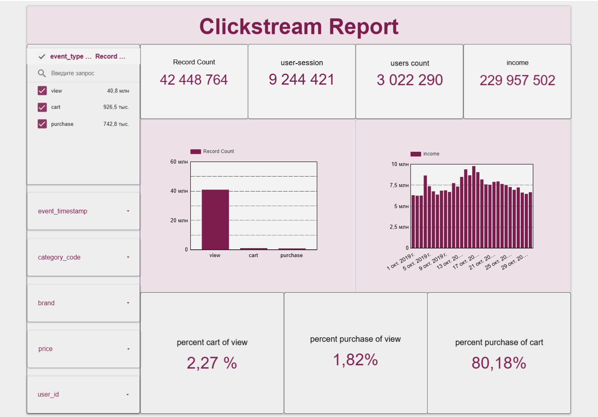

E-Commerce Clickstream Data Analytics & BI Report
An end-to-end data analytics project focused on processing, analyzing, and visualizing large-scale clickstream data from an e-commerce platform. The project processes a dataset of over 42 million user events to map out the conversion funnel and deliver actionable business insights via an interactive dashboard.

🚀 Project Overview
The main objective of this project is to model user behavior on an e-commerce platform and analyze the core sales funnel. By leveraging a modern data stack, the project tracks how users transition from initial product views to cart additions and final purchases.

Core Metrics Achieved:
Cart to View Conversion Rate: 2.27%

Purchase to Cart Conversion Rate: 80.18%

Overall Purchase to View Conversion Rate: 1.82%

🛠 Tech Stack
BI Visualization: Looker Studio

Data Warehouse: Google BigQuery

Languages: SQL

📐 Architecture & Key Features
1. Data Cleaning & Optimization (SQL)
Handled timestamps by extracting raw user activity data into a clean DATE format, enabling accurate day-over-day and cohort analysis.

Normalized text and event inputs by converting mixed-case category fields into a unified lowercase standard to avoid data fragmentation.

2. Funnel Metrics Calculation (Looker Studio)
Implemented conditional aggregation formulas using CASE WHEN and COUNT_DISTINCT to isolate individual user actions and build a reliable behavioral funnel.

Configured proper aggregation techniques (Auto / Sum) to eliminate double-multiplication bugs when rendering percentage metrics.

Embedded NULLIF handling within division statements to ensure zero-division safety during low-traffic intervals.

3. UI/UX Dashboard Design
Developed an intuitive dashboard layout displaying high-level KPIs: Total Record Count, Unique User Sessions, Unique Users Count, and Total Income.

Added dynamic controls allowing stakeholders to filter the entire dataset by category_code, brand, price, and user_id.

📊 Dashboard Preview
The dashboard maps out the primary user events:

view (~40.8 million events) → Initial product page interaction.

cart (~926.5 thousand events) → Adding items to the shopping cart.

purchase (~742.8 thousand events) → Successful checkout and revenue generation.

Here is the preview of the final clickstream dashboard:

